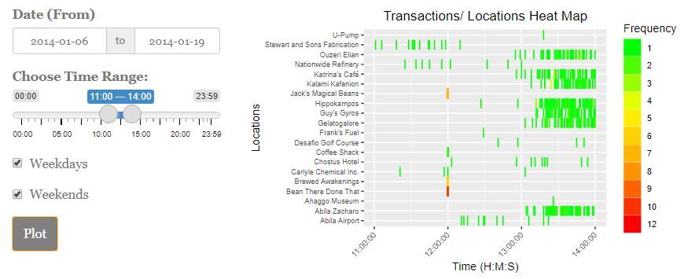

# Introduction

A fictitious scenario was created as part of VAST Challenge 2021. A group of staff members from GASTech, an oil and gas company situated on an island known as Abila on Kronos, had gone missing mysteriously. A group known as Protectors of Kronos (POK) was the prime suspect into the disappearance. While Mini Challenge 1 and 2 provided a set of raw data that allow investigators to establish and identify complex relationships among the people and organisations, discover anomalies and suspicious activities, such investigative work may require humongous man hours and effort, without data analytics and visualisation. 

We would be using Shiny R to develop an online investigative tool to aid in the analysis into the disappearance of GASTech Personnel, allowing investigators to explore information and inferential statistics derived from the unprocessed data available.

# Motivation

The motivation of this project is two-fold. First, the data presented to the investigators were raw and unprocessed, and to link and derive insights from these data would require tremendous man hours and effort. Second, while insights could be derived and useful information could be formed, there would be a need to present the information in a visually appealing format to facilitate information dissemination and to allow quick collective appreciation of events among the investigators.

To this end, we would be looking to develop a R Shiny app based on three principles: (a) informative; (b) intuitive and; (c) interactive. Our 3Is principles would have the data undergoing baseline cleaning, making them into suitable formats for subsequent processing for information delivery. The user-interface would be made intuitive so that the investigator would be able to use the application without much references to our user guide. The online investigative tool would also be interactive, such that the investigator would be able to provide varied inputs into the formation towards the final visualisation report.

The R Shiny app would comprise of two main modules: (a) Exploratory Data Analysis allowing investigators to draw information such as transaction records, employee records, email correspondences and such; (b) Inferential Statistics allowing investigators to infer relationship linkages among user-selected employees, possible coded words within email correspondences within an identified group of personnel, their movements towards identified locations and possible anomalies at the locations and transaction analysis using both credit card and loyalty card data.

# Review and Critic of Past Works

Duis nec purus sed neque porttitor tincidunt vitae quis augue. Donec porttitor aliquam ante, nec convallis nisl ornare eu. Morbi ut purus et justo commodo dignissim et nec nisl. Donec imperdiet tellus dolor, vel dignissim risus venenatis eu. Aliquam tempor imperdiet massa, nec fermentum tellus sollicitudin vulputate. Integer posuere porttitor pharetra. Praesent vehicula elementum diam a suscipit. Morbi viverra velit eget placerat pellentesque. Nunc congue augue non nisi ultrices tempor.

# Design Frame

Our R Shiny Investigative Tool's design would be based on our 3Is principle.

*Informative* - A series of informative modules would be made available under the Exploratory Data Analysis (EDA) tab, comprising of: (a) Locations Exploration; (b) Transactions Exploration; (c) Cards Exploration; (d) GASTech Employees Information; and (e) Email Correspondences. Details of each modules would be covered under the sub-sections later.

*Intuitive* - The entire UI design would be simple and intuitive, allowing investigators to use it without frequent references to our user guide. This would be done by ensuring that appropriate input methods were used and that the UI would be kept as clean and simple as possible.

*Interactive* - The respective modules would require specific inputs from the investigators before a representative visualisation could be produced. It would be made interactive such that the investigators would have the flexibility to select various variables or inputs to create the desired visualisation. Similarly, the investigators would have the option to save the produced visualisation separately.

# Exploratory Data Analysis

## Locations - For Exploration!

Duis nec purus sed neque porttitor tincidunt vitae quis augue. Donec porttitor aliquam ante, nec convallis nisl ornare eu. Morbi ut purus et justo commodo dignissim et nec nisl. Donec imperdiet tellus dolor, vel dignissim risus venenatis eu. Aliquam tempor imperdiet massa, nec fermentum tellus sollicitudin vulputate. Integer posuere porttitor pharetra. Praesent vehicula elementum diam a suscipit. Morbi viverra velit eget placerat pellentesque. Nunc congue augue non nisi ultrices tempor.

## Transactions - For Exploration!

Duis nec purus sed neque porttitor tincidunt vitae quis augue. Donec porttitor aliquam ante, nec convallis nisl ornare eu. Morbi ut purus et justo commodo dignissim et nec nisl. Donec imperdiet tellus dolor, vel dignissim risus venenatis eu. Aliquam tempor imperdiet massa, nec fermentum tellus sollicitudin vulputate. Integer posuere porttitor pharetra. Praesent vehicula elementum diam a suscipit. Morbi viverra velit eget placerat pellentesque. Nunc congue augue non nisi ultrices tempor.

## Individual Card Transactions

Duis nec purus sed neque porttitor tincidunt vitae quis augue. Donec porttitor aliquam ante, nec convallis nisl ornare eu. Morbi ut purus et justo commodo dignissim et nec nisl. Donec imperdiet tellus dolor, vel dignissim risus venenatis eu. Aliquam tempor imperdiet massa, nec fermentum tellus sollicitudin vulputate. Integer posuere porttitor pharetra. Praesent vehicula elementum diam a suscipit. Morbi viverra velit eget placerat pellentesque. Nunc congue augue non nisi ultrices tempor.

## Employees of GasTech

Duis nec purus sed neque porttitor tincidunt vitae quis augue. Donec porttitor aliquam ante, nec convallis nisl ornare eu. Morbi ut purus et justo commodo dignissim et nec nisl. Donec imperdiet tellus dolor, vel dignissim risus venenatis eu. Aliquam tempor imperdiet massa, nec fermentum tellus sollicitudin vulputate. Integer posuere porttitor pharetra. Praesent vehicula elementum diam a suscipit. Morbi viverra velit eget placerat pellentesque. Nunc congue augue non nisi ultrices tempor.

## Email Correspondence

Duis nec purus sed neque porttitor tincidunt vitae quis augue. Donec porttitor aliquam ante, nec convallis nisl ornare eu. Morbi ut purus et justo commodo dignissim et nec nisl. Donec imperdiet tellus dolor, vel dignissim risus venenatis eu. Aliquam tempor imperdiet massa, nec fermentum tellus sollicitudin vulputate. Integer posuere porttitor pharetra. Praesent vehicula elementum diam a suscipit. Morbi viverra velit eget placerat pellentesque. Nunc congue augue non nisi ultrices tempor.

# Inferential Statistics

## Email Network Analysis

Duis nec purus sed neque porttitor tincidunt vitae quis augue. Donec porttitor aliquam ante, nec convallis nisl ornare eu. Morbi ut purus et justo commodo dignissim et nec nisl. Donec imperdiet tellus dolor, vel dignissim risus venenatis eu. Aliquam tempor imperdiet massa, nec fermentum tellus sollicitudin vulputate. Integer posuere porttitor pharetra. Praesent vehicula elementum diam a suscipit. Morbi viverra velit eget placerat pellentesque. Nunc congue augue non nisi ultrices tempor.

## Networks

Duis nec purus sed neque porttitor tincidunt vitae quis augue. Donec porttitor aliquam ante, nec convallis nisl ornare eu. Morbi ut purus et justo commodo dignissim et nec nisl. Donec imperdiet tellus dolor, vel dignissim risus venenatis eu. Aliquam tempor imperdiet massa, nec fermentum tellus sollicitudin vulputate. Integer posuere porttitor pharetra. Praesent vehicula elementum diam a suscipit. Morbi viverra velit eget placerat pellentesque. Nunc congue augue non nisi ultrices tempor.

## Employee Movement Plot

Duis nec purus sed neque porttitor tincidunt vitae quis augue. Donec porttitor aliquam ante, nec convallis nisl ornare eu. Morbi ut purus et justo commodo dignissim et nec nisl. Donec imperdiet tellus dolor, vel dignissim risus venenatis eu. Aliquam tempor imperdiet massa, nec fermentum tellus sollicitudin vulputate. Integer posuere porttitor pharetra. Praesent vehicula elementum diam a suscipit. Morbi viverra velit eget placerat pellentesque. Nunc congue augue non nisi ultrices tempor.

## Transaction Amount Analysis

Duis nec purus sed neque porttitor tincidunt vitae quis augue. Donec porttitor aliquam ante, nec convallis nisl ornare eu. Morbi ut purus et justo commodo dignissim et nec nisl. Donec imperdiet tellus dolor, vel dignissim risus venenatis eu. Aliquam tempor imperdiet massa, nec fermentum tellus sollicitudin vulputate. Integer posuere porttitor pharetra. Praesent vehicula elementum diam a suscipit. Morbi viverra velit eget placerat pellentesque. Nunc congue augue non nisi ultrices tempor.

# Future Works

Duis nec purus sed neque porttitor tincidunt vitae quis augue. Donec porttitor aliquam ante, nec convallis nisl ornare eu. Morbi ut purus et justo commodo dignissim et nec nisl. Donec imperdiet tellus dolor, vel dignissim risus venenatis eu. Aliquam tempor imperdiet massa, nec fermentum tellus sollicitudin vulputate. Integer posuere porttitor pharetra. Praesent vehicula elementum diam a suscipit. Morbi viverra velit eget placerat pellentesque. Nunc congue augue non nisi ultrices tempor.

# Acknowledgements

The authors wish to thank Professor Kam Tin Seong of Singapore Management University for his extensive guidance
and support during this project.

---
references:
- id: meier2012
  title: Professinal Android 4 Application Development
  author: 
  - family: Meier
    given: Reto
  type: book
  publisher: John Wiley & Sons, Inc.
  issued:
    year: 2012
    month: 5
- id: fenner2012a
  title: One-click science marketing
  author:
  - family: Fenner
    given: Martin
  container-title: Nature Materials
  volume: 11
  URL: 'https://doi.org/10.1038/nmat3283'
  DOI: 10.1038/nmat3283
  issue: 4
  publisher: Nature Publishing Group
  page: 261-263
  type: article-journal
  issued:
    year: 2012
    month: 3
---
