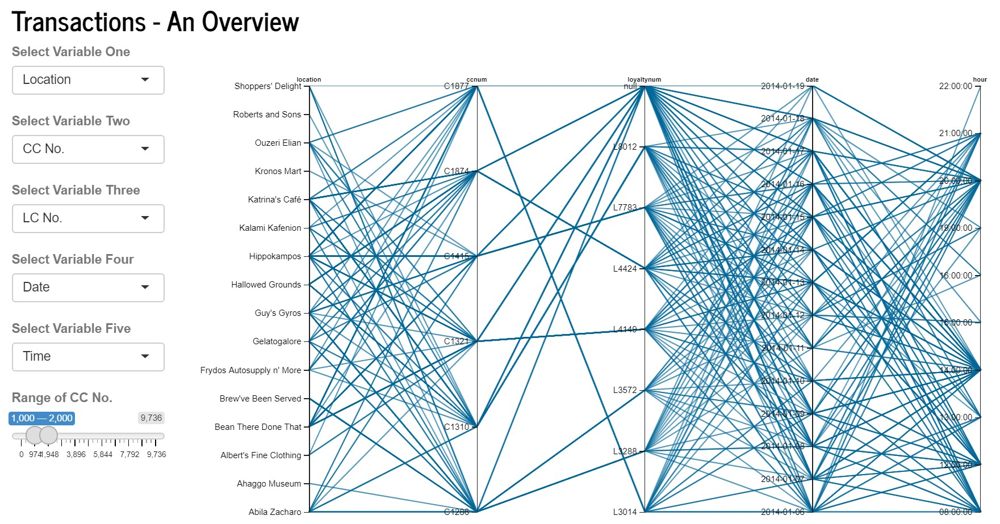
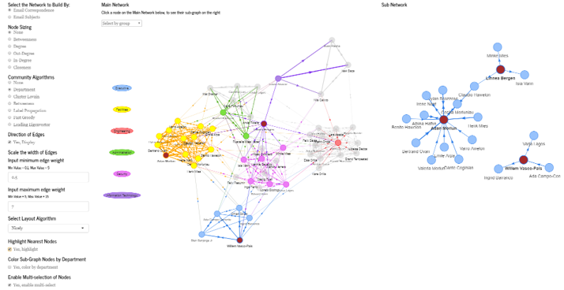

```{r setup, include=FALSE}
knitr::opts_chunk$set(echo = FALSE)
```

# Introduction

A fictitious scenario was created as part of `VAST Challenge 2021`. A group of staff members from GASTech, an oil and gas company situated on an island known as Abila on Kronos, had gone missing mysteriously. A group known as Protectors of Kronos (POK) was the prime suspect into the disappearance. While Mini Challenge 1 and 2 provided a set of raw data that allow investigators to establish and identify complex relationships among the people and organisations, discover anomalies and suspicious activities, such investigative work may require humongous man hours and effort, without data analytics and visualisation. 

We would be using Shiny R to develop an online investigative tool to aid in the analysis into the disappearance of GASTech Personnel, allowing investigators to explore information and inferential statistics derived from the unprocessed data available.

# Motivation

The motivation of this project would be two-fold. First, the data presented to the investigators were raw and unprocessed, and to link and derive insights from these data would require tremendous man hours and effort. Second, while insights could be derived and useful information could be formed, there would be a need to present the information in a visually appealing format to facilitate information dissemination and to allow quick collective appreciation of events among the investigators.

To this end, we would be looking to develop a R Shiny app based on three principles: (a) informative; (b) intuitive and; (c) interactive. Our 3Is principles would have the data undergoing baseline cleaning, making them into suitable formats for subsequent processing for information delivery. The user-interface would be made intuitive so that the investigator would be able to use the application without much references to our user guide. The online investigative tool would also be interactive, such that the investigator would be able to provide varied inputs into the formation towards the final visualisation report.

The R Shiny app would comprise of two main modules: (a) Exploratory Data Analysis allowing investigators to draw information such as transaction records, employee records, email correspondences and such; (b) Inferential Statistics allowing investigators to infer relationship linkages among user-selected employees, possible coded words within email correspondences within an identified group of personnel, their movements towards identified locations and possible anomalies at the locations and transaction analysis using both credit card and loyalty card data.

# Design Frame

Our R Shiny Investigative Tool's design would be based on our 3Is principle.

*Informative* - A series of informative modules would be made available under the Exploratory Data Analysis (EDA) tab, comprising of: (a) Locations Exploration; (b) Transactions Exploration; (c) Cards Exploration; (d) GASTech Employees Information; and (e) Email Correspondences. Details of each modules would be covered under the sub-sections later.

*Intuitive* - The entire UI design would be simple and intuitive, allowing investigators to use it without frequent references to our user guide. This would be done by ensuring that appropriate input methods were used and that the UI would be kept as clean and simple as possible.

*Interactive* - The respective modules would require specific inputs from the investigators before a representative visualisation could be produced. It would be made interactive such that the investigators would have the flexibility to select various variables or inputs to create the desired visualisation. Similarly, the investigators would have the option to save the produced visualisation separately.

# Exploratory Data Analysis

Under our EDA module, there would be 5 modules, as mentioned above, to allow the investigators to conduct data exploratory analysis. One of our featured module is the link graph. The intention of this module would be to allow investigators to explore all credit card and loyalty card transactional records at each location. The type of visualization chosen enables the investigators to see the linkages between all variables in one view. 

{width=100%}
The plot has multiple functions which would allow the investigator to customize his/her view and get more insights, such as (1) Variables to be included can be selected, (2) Variables can be reordered, (3) Range of Credit Card Numbers to display records for can be selected, (4) Specific ranges of each variable can be selected so that only associated links would be shown, (5) Selected ranges can be glided along the axis to see how the connections change dynamically. These customizations and flexibilities are important so that the user can zoom in and out on selected areas of focus, especially when exploring raw data sets. If a certain value, say for a specific credit card number, appears in multiple observations, its associations would be clearly displayed in the form of the series of lines.

# Inferential Statistics

Under our Inferential Statistics, it would enable investigators go beyond EDA allowing the inference of data to deepen the analysis. One of our inferential statistics module would be the networks graph that would allow the investigators to see the overall email network at GasTech, run layout, community detection algorithms and identify key nodes through centrality measures. There are one of 2 options the investigator could see, network by email conversation or network by content of the email subjects. 

The side panel contains all the measures that can be changed, this includes node sizing, community algorithm and layout algorithms. 

{width=100%}

This tab allows the use of network analysis algorithm to identify key nodes within the network. Similar to previous, the user has freedom to enable multi-select, highlight nearest nodes and also direct interaction with the network.

# Future Works

For the email network analysis, the data did not provide us with the actual content of the email. While subjects can be useful for the investigator to make reasonable judgments, there could be confirmation biases and logical fallacies with that for e.g. suspected members of the POK using similar subjects for different email content. 

This can be addressed with the provision of the email content data. In addition to that, the text network can become more accurately with better data.

The parallel coordinate plot in the Transactions Analysis Overview page is currently only based on pure transactions data. Further insights could be drawn, if the plot could be joined with data on vehicle IDs which made stops at that particular location, in that particular period. This would allow the investigator to narrow down which are the possible vehicle IDs that could have made the transaction, or owned the credit card or loyalty card. Linking to vehicle ID would enable the investigator to link to the personnel based on who the vehicle is assigned to.

An improvement towards the Employee Movement Plot could include further analysis on the movement route, in terms of the distance/ speed, which may suggest the vehicle were kept in idle mode, which is currently unable to detected under the current module. In addition, the streets of Abila could be identified based on the movement routes, and thus, and analysis could be conducted whether the vehicle was travelling in a suspicious manner.
