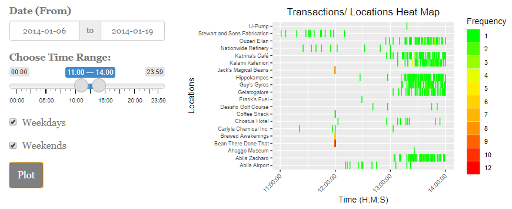

# Introduction

A fictitious scenario was created as part of VAST Challenge 2021. A group of staff members from GASTech, an oil and gas company situated on an island known as Abila on Kronos, had gone missing mysteriously. A group known as Protectors of Kronos (POK) was the prime suspect into the disappearance. While Mini Challenge 1 and 2 provided a set of raw data that allow investigators to establish and identify complex relationships among the people and organisations, discover anomalies and suspicious activities, such investigative work may require humongous man hours and effort, without data analytics and visualisation. 

We would be using Shiny R to develop an online investigative tool to aid in the analysis into the disappearance of GASTech Personnel, allowing investigators to explore information and inferential statistics derived from the unprocessed data available.

# Motivation

The motivation of this project would be two-fold. First, the data presented to the investigators were raw and unprocessed, and to link and derive insights from these data would require tremendous man hours and effort. Second, while insights could be derived and useful information could be formed, there would be a need to present the information in a visually appealing format to facilitate information dissemination and to allow quick collective appreciation of events among the investigators.

To this end, we would be looking to develop a R Shiny app based on three principles: (a) informative; (b) intuitive and; (c) interactive. Our 3Is principles would have the data undergoing baseline cleaning, making them into suitable formats for subsequent processing for information delivery. The user-interface would be made intuitive so that the investigator would be able to use the application without much references to our user guide. The online investigative tool would also be interactive, such that the investigator would be able to provide varied inputs into the formation towards the final visualisation report.

The R Shiny app would comprise of two main modules: (a) Exploratory Data Analysis allowing investigators to draw information such as transaction records, employee records, email correspondences and such; (b) Inferential Statistics allowing investigators to infer relationship linkages among user-selected employees, possible coded words within email correspondences within an identified group of personnel, their movements towards identified locations and possible anomalies at the locations and transaction analysis using both credit card and loyalty card data.

# Review and Critic of Past Works

Taking reference on a submission by students from International Institute of Information Technology Hyderabad, they had derived an interface that uses geotools to show the paths of the cars, moving at a particular time or date.  While it was a useful tool to visualise the movement of the vehicles, it was unable to plot the locations where the vehicles may had visited. This would be addressed in one of our module.

While credit card data and loyalty card data were provided for, to the investigators, there are no direct linkages between both set of data, except for the locations and price of item. The timestamp for both data are recorded differently with the credit card indicating the time of transaction while loyalty data indicating date of transactions only. Reviewing past work from members of University of Calgary, they attempted Parallel Coordinates plot by linking the locations, timestamp, price and employees, to establish possible linkages among the four variables. Inspired by their work and the sharing from Prof Kam on using Parallel Coordinates Plot on R, we would attempt to create parallel plots and allow the investigators to decide the variables that they are keen to establish linkages with.

# Design Frame

Our R Shiny Investigative Tool's design would be based on our 3Is principle.

*Informative* - A series of informative modules would be made available under the Exploratory Data Analysis (EDA) tab, comprising of: (a) Locations Exploration; (b) Transactions Exploration; (c) Cards Exploration; (d) GASTech Employees Information; and (e) Email Correspondences. Details of each modules would be covered under the sub-sections later.

*Intuitive* - The entire UI design would be simple and intuitive, allowing investigators to use it without frequent references to our user guide. This would be done by ensuring that appropriate input methods were used and that the UI would be kept as clean and simple as possible.

*Interactive* - The respective modules would require specific inputs from the investigators before a representative visualisation could be produced. It would be made interactive such that the investigators would have the flexibility to select various variables or inputs to create the desired visualisation. Similarly, the investigators would have the option to save the produced visualisation separately.

# Exploratory Data Analysis

## Locations - For Exploration!

The intention of this module would be to allow the investigators to explore the popularity of the locations through the analysis of transaction records. It would be conducted in a manner by aggregating the transaction records based on the time of transactions. The transaction counts would be plotted against the aggregated time of transactions and locations using a heatmap to infer the peak periods for the locations. The selected records would be filtered based on the range of date inputs, time range of transactions, with the ability to toggle between weekdays, weekends or both.

The function of this module would be to identify the operating days of the locations through the analysis of credit card transactions, through the aggregation of records based on the day of transactions. The output of this visualisation would suggest the days where the locations would be having transactions, thus inferring their operating days of the week.

## Transactions - For Exploration!

The intention of this module would be to allow investigators to explore all credit card and loyalty card transactional records at each location. The type of visualization chosen enables the investigators to see the linkages between all variables in one view. 

The plot has multiple functions which would allow the investigator to customize his/her view and get more insights, such as (1) Variables to be included can be selected, (2) Variables can be reordered, (3) Range of Credit Card Numbers to display records for can be selected, (4) Specific ranges of each variable can be selected so that only associated links would be shown, (5) Selected ranges can be glided along the axis to see how the connections change dynamically. These customizations and flexibilities are important so that the user can zoom in and out on selected areas of focus, especially when exploring raw data sets. If a certain value, say for a specific credit card number, appears in multiple observations, its associations would be clearly displayed in the form of the series of lines.

## Individual Card Transactions

This module allows the investigator to visualize the transactions made by individual cards for a more in-depth exploration. The page allows the investigator to select two different cards to be displayed, akin to a workspace for comparison between cards. This is essentially a deep-dive compared to the parallel coordinate plot, which gives an overview.

The investigator could select the card type, credit card or loyalty card. If credit card is selected, an additional field would appear to allow selection of type of fill for the tiles. 

Location is plotted against each day. If there was a transaction at the location for that day, a tile would appear. For this module, the tile plot is chosen as its uniform tiles allow a straightforward view of whether transactions were made consecutively for each day, or on separate days. The color intensity of the tile would give an indication of the magnitude of the transaction amount - the darker the intensity, the higher the amount. Hovering over each tile would display a tooltip indicating the details of that particular transaction. A data table for the selected card would also appear below the tile plot to list down all observations, it can be sorted and filtered, to allow for the investigator's further exploration.

## Employees of GasTech

Duis nec purus sed neque porttitor tincidunt vitae quis augue. Donec porttitor aliquam ante, nec convallis nisl ornare eu. Morbi ut purus et justo commodo dignissim et nec nisl. Donec imperdiet tellus dolor, vel dignissim risus venenatis eu. Aliquam tempor imperdiet massa, nec fermentum tellus sollicitudin vulputate. Integer posuere porttitor pharetra. Praesent vehicula elementum diam a suscipit. Morbi viverra velit eget placerat pellentesque. Nunc congue augue non nisi ultrices tempor.

## Email Correspondence

Duis nec purus sed neque porttitor tincidunt vitae quis augue. Donec porttitor aliquam ante, nec convallis nisl ornare eu. Morbi ut purus et justo commodo dignissim et nec nisl. Donec imperdiet tellus dolor, vel dignissim risus venenatis eu. Aliquam tempor imperdiet massa, nec fermentum tellus sollicitudin vulputate. Integer posuere porttitor pharetra. Praesent vehicula elementum diam a suscipit. Morbi viverra velit eget placerat pellentesque. Nunc congue augue non nisi ultrices tempor.

# Inferential Statistics

## Email Network Analysis

Duis nec purus sed neque porttitor tincidunt vitae quis augue. Donec porttitor aliquam ante, nec convallis nisl ornare eu. Morbi ut purus et justo commodo dignissim et nec nisl. Donec imperdiet tellus dolor, vel dignissim risus venenatis eu. Aliquam tempor imperdiet massa, nec fermentum tellus sollicitudin vulputate. Integer posuere porttitor pharetra. Praesent vehicula elementum diam a suscipit. Morbi viverra velit eget placerat pellentesque. Nunc congue augue non nisi ultrices tempor.

## Networks

Duis nec purus sed neque porttitor tincidunt vitae quis augue. Donec porttitor aliquam ante, nec convallis nisl ornare eu. Morbi ut purus et justo commodo dignissim et nec nisl. Donec imperdiet tellus dolor, vel dignissim risus venenatis eu. Aliquam tempor imperdiet massa, nec fermentum tellus sollicitudin vulputate. Integer posuere porttitor pharetra. Praesent vehicula elementum diam a suscipit. Morbi viverra velit eget placerat pellentesque. Nunc congue augue non nisi ultrices tempor.

## Employee Movement Plot

The data preparation for this module would be to identify Points-of-Interests (POI), using the gps records. Since the recording of gps would only occur while the vehicle is in motion, whenever there is a time interval (3g: 3 minutes), would be a good assumption that the vehicle is in parking mode, thus indicating it as a POI. The time interval may be adjusted based on the investigators' tolerance between 3 and 15 minutes. The POIs would be differentiated between homes of employees and other locations, thus allowing tmap to plot the route taken, and the stops taken.

The sub-module would be an extension where the selected gps plot would be sequenced based on the time of activity, and further identified based on marked locations such as their homes, GASTech or prominent locations that were named prior. The subsequent box plot would be an analysis of the duration of stop, by visitors, to the locations.

## Transaction Amount Analysis

This module provides statistical analysis on the transactions made at each location, by each card type. The distribution of the spread of the transaction amounts is shown by boxplots. Outliers are highlighted in red to gain the investigator's attention.

The plots are categorized by the location types, as we believe transaction amounts should be compared with those made at similar locations (For e.g. F&B with F&B, Industrial with Industrial). It would not be logical to compare a transaction made at a supermarket, with one made at a chemical production factory. This would be useful if the investigator wishes to understand what is a normal range of transaction price for each location, and which transactions deviated from the normal ranges. An additional value-added feature that can be derived from this plot, is the investigator can identify credit card and loyalty card pairs as they would have the same transaction price, on the same day. 

A further deep dive can be performed with the specific card transactions scatter plot positioned below the overall boxplot. 

This is a scatter plot of all transactions made by the card selected by the investigator. Each point represents one transaction, and positioned according to the transaction amount. How the amounts made at the same location are relative to each other can be seen by their colors as well - the darker the intensity, the higher the amount. As it is possible to have multiple points clustered close together, some transparency is set so that any overlaps are clearly visible. 
 

# Future Works

For the email network analysis, the data did not provide us with the actual content of the email. While subjects can be useful for the investigator to make reasonable judgments, there could be confirmation biases and logical fallacies with that for e.g. suspected members of the POK using similar subjects for different email content. 

This can be addressed with the provision of the email content data. In addition to that, the text network can become more accurately with better data.

The parallel coordinate plot in the Transactions Analysis Overview page is currently only based on pure transactions data. Further insights could be drawn, if the plot could be joined with data on vehicle IDs which made stops at that particular location, in that particular period. This would allow the investigator to narrow down which are the possible vehicle IDs that could have made the transaction, or owned the credit card or loyalty card. Linking to vehicle ID would enable the investigator to link to the personnel based on who the vehicle is assigned to.

An improvement towards the Employee Movement Plot could include further analysis on the movement route, in terms of the distance/ speed, which may suggest the vehicle were kept in idle mode, which is currently unable to detected under the current module. In addition, the streets of Abila could be identified based on the movement routes, and thus, and analysis could be conducted whether the vehicle was travelling in a suspicious manner.

# Acknowledgements

The authors wish to thank Professor Kam Tin Seong of Singapore Management University for his extensive guidance
and support during this project.

# References

---
references:
- id: IIITH
  title: VAST Challenge 2014 Mini Challenge 2
  author: "Pochampally, Yashaswi; Yarrabelly, Navya; Chikka, Veera Raghavendra and Karlapalem, Karlapalem"
  container-title: 'http://visualdata.wustl.edu/varepository/VAST%20Challenge%202014/challenges/MC2%20-%20Patterns%20of%20Life%20Analysis/entries/International%20Institute%20of%20Information%20Technology%20Hyderabad/'
  URL: 'http://visualdata.wustl.edu/varepository/VAST%20Challenge%202014/challenges/MC2%20-%20Patterns%20of%20Life%20Analysis/entries/International%20Institute%20of%20Information%20Technology%20Hyderabad/'
  type: website
  issued:
    year: 2014
- id: UC
  title: VAST Challenge 2014 Mini Challenge 2
  author: "Sahaf, Zahra et al."
  container-title: 'http://visualdata.wustl.edu/varepository/VAST%20Challenge%202014/challenges/MC2%20-%20Patterns%20of%20Life%20Analysis/entries/University%20of%20Calgary/'
  URL: 'http://visualdata.wustl.edu/varepository/VAST%20Challenge%202014/challenges/MC2%20-%20Patterns%20of%20Life%20Analysis/entries/University%20of%20Calgary/'
  type: website
  issued:
    year: 2014
- id: profkam
  title: "Hands-On Exercise 8: Creating Parallel Coordinate Plot"
  author: "Kam, Tin Seong"
  container-title: 'https://rpubs.com/tskam/PCP'
  URL: 'https://rpubs.com/tskam/PCP'
  type: website
  issued:
    year: 2020
    month: 03
    day: 13
- id: Avil
  title: VAST Challenge 2014 Mini Challenge 1
  author: "Avil, Pilar; Burgos, Valeria; Chikka, Guaymás Amalia"
  container-title: 'https://www.cs.umd.edu/hcil/varepository/VAST%20Challenge%202014/challenges/MC1%20-%20Disappearance%20at%20GASTech/entries/University%20of%20Buenos%20Aires%20-%20Avila/'
  URL: 'https://www.cs.umd.edu/hcil/varepository/VAST%20Challenge%202014/challenges/MC1%20-%20Disappearance%20at%20GASTech/entries/University%20of%20Buenos%20Aires%20-%20Avila/'
  type: website
  issued:
    year: 2014
- id: Zhuang
  title: VAST Challenge 2014 Mini Challenge 1
  author: "Zhuang, Cai; Mengyao Chen;, Hanqing Zhao; Ying Zhao; Fangfang Zhou; Kang Zhang;"
  container-title: 'https://www.cs.umd.edu/hcil/varepository/VAST%20Challenge%202014/challenges/MC1%20-%20Disappearance%20at%20GASTech/entries/Tianjin%20University%20-%20Cai/'
  URL: 'https://www.cs.umd.edu/hcil/varepository/VAST%20Challenge%202014/challenges/MC1%20-%20Disappearance%20at%20GASTech/entries/Tianjin%20University%20-%20Cai/'
  type: website
  issued:
    year: 2014

...
