```{css zoom-lib-src, echo = FALSE}
script src = "https://ajax.googleapis.com/ajax/libs/jquery/3.4.1/jquery.min.js"
```


```{js zoom-jquery, echo = FALSE}
 $(document).ready(function() {
    $('body').prepend('<div class=\"zoomDiv\"></div>');
    // onClick function for all plots (img's)
    $('img:not(.zoomImg)').click(function() {
      $('.zoomImg').attr('src', $(this).attr('src')).css({width: '100%'});
      $('.zoomDiv').css({opacity: '1', width: 'auto', border: '1px solid white', borderRadius: '5px', position: 'fixed', top: '50%', left: '50%', marginRight: '-50%', transform: 'translate(-50%, -50%)', boxShadow: '0px 0px 50px #888888', zIndex: '50', overflow: 'auto', maxHeight: '100%'});
    });
    // onClick function for zoomImg
    $('img.zoomImg').click(function() {
      $('.zoomDiv').css({opacity: '0', width: '0%'}); 
    });
  });
```

```{r setup, include=FALSE}
knitr::opts_chunk$set(echo = FALSE)
```

**Click the link below to go to the application page**

[Link To Application](https://dtcs.shinyapps.io/ISSS608_G1_T08/)


**Click the link below to download the User Guide**


```{r echo=FALSE}
xfun::embed_file('User Guide/R Shiny User Guide.pdf')
```


**Click on the pages to see an enlarged version**

### User Guide Page 1

```{r, fig.}
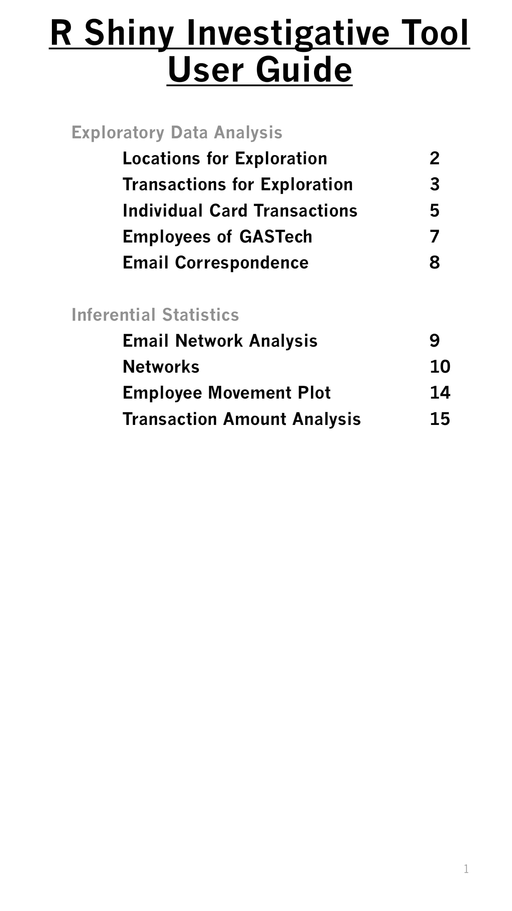
```

### User Guide Page 2

```{r}
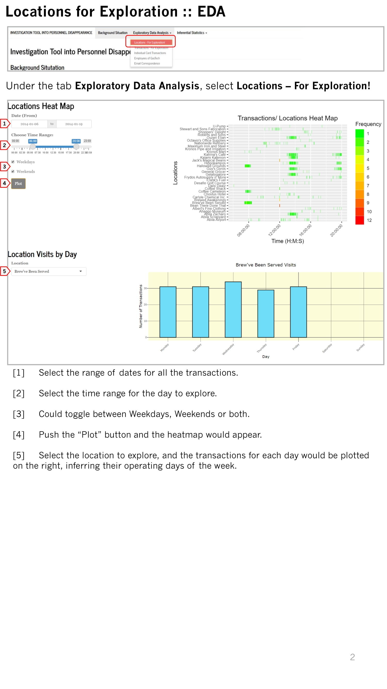
```

### User Guide Page 3

```{r}
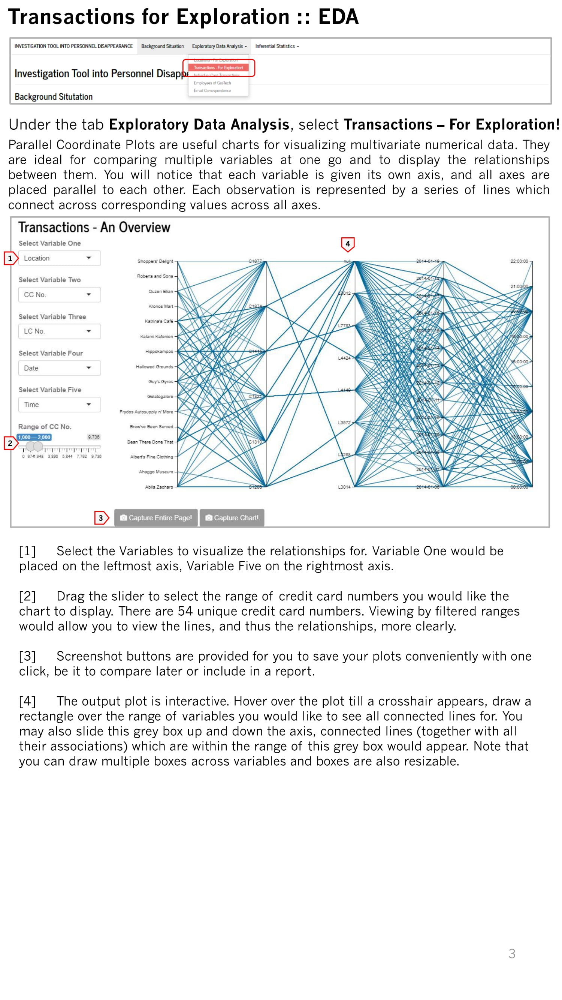
```

### User Guide Page 4

```{r}
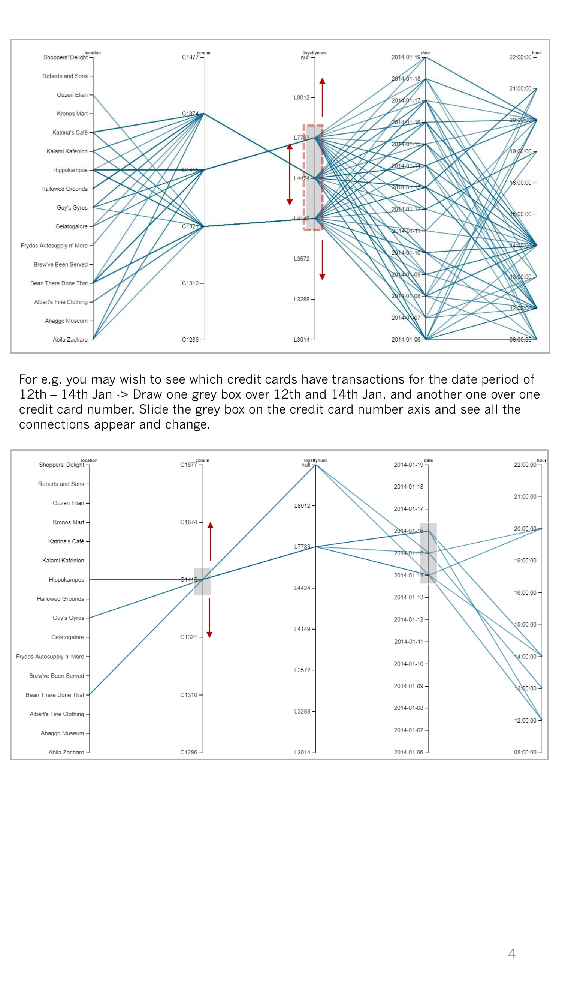
```

### User Guide Page 5

```{r}
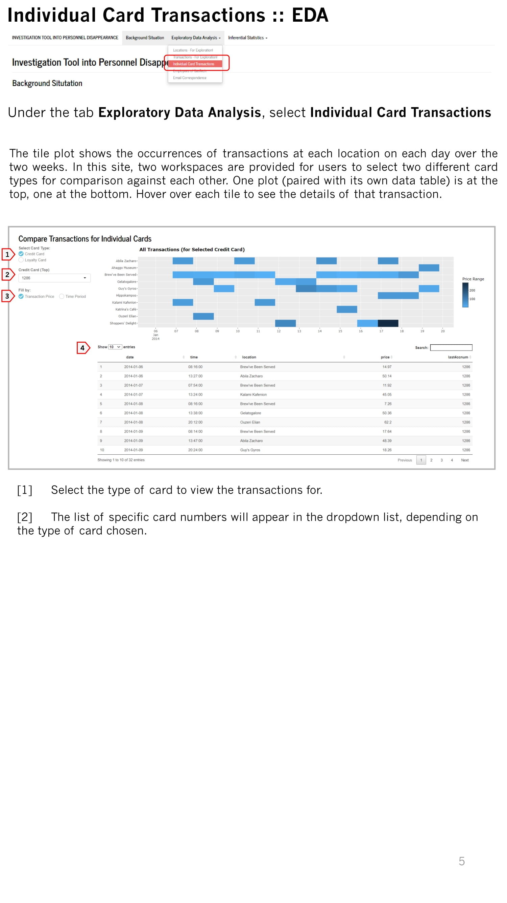
```

### User Guide Page 6

```{r}
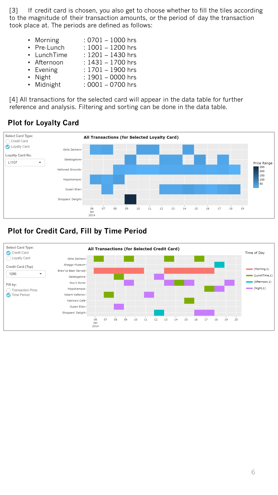
```

### User Guide Page 7

```{r}
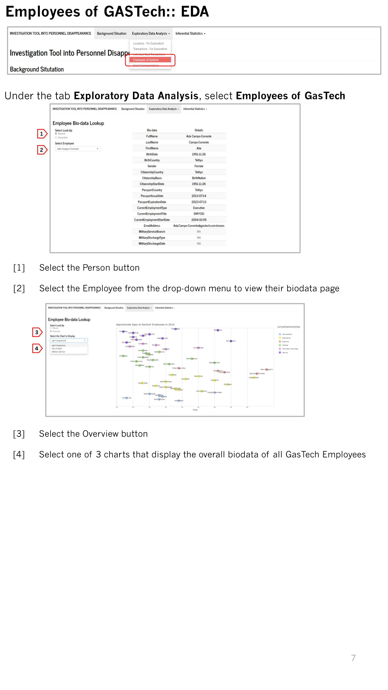
```

### User Guide Page 8

```{r}
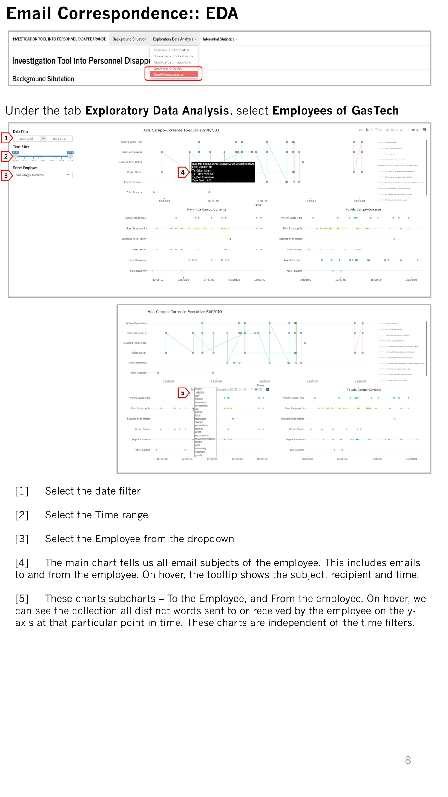
```

### User Guide Page 9

```{r}
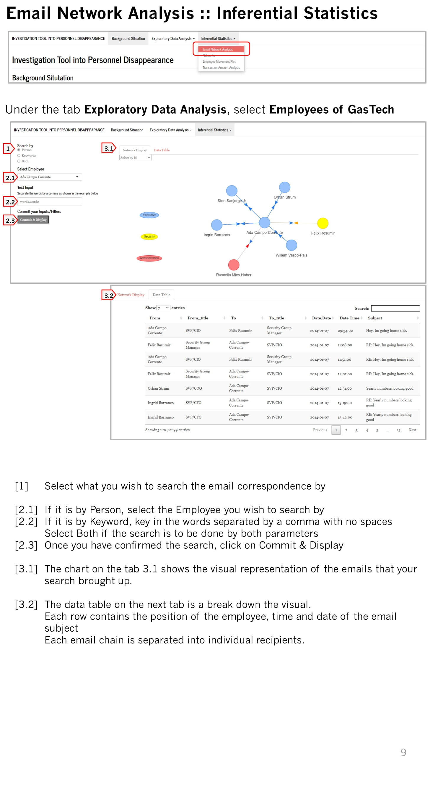
```

### User Guide Page 10

```{r}
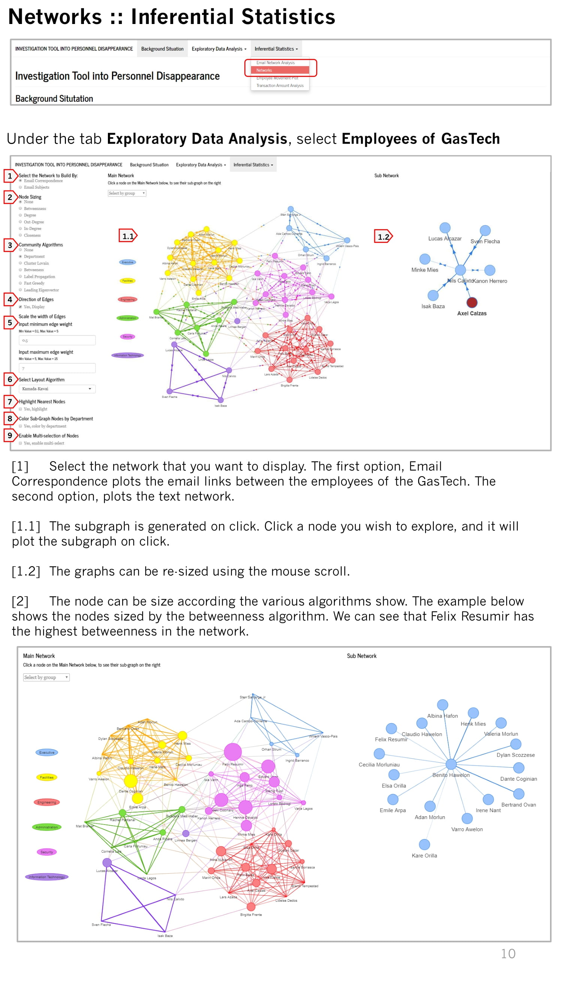
```

### User Guide Page 11

```{r}
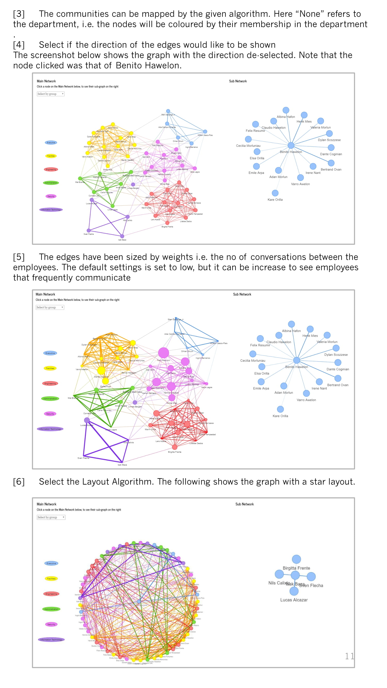
```

### User Guide Page 12

```{r}
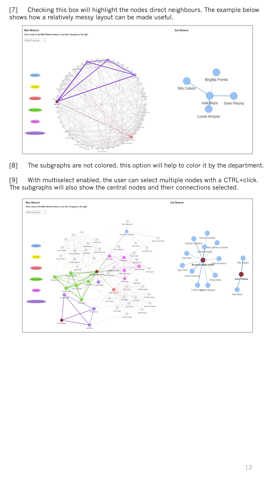
```

### User Guide Page 13

```{r}
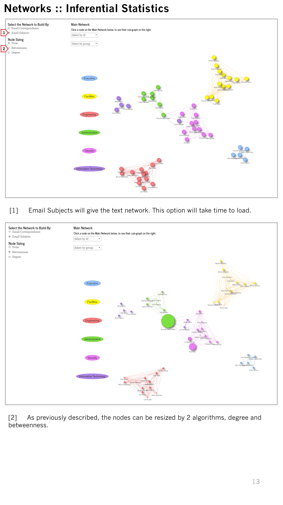
```

### User Guide Page 14

```{r}
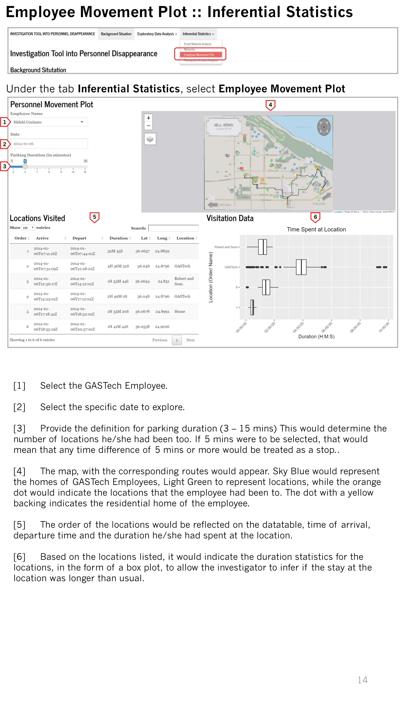
```

### User Guide Page 15

```{r}
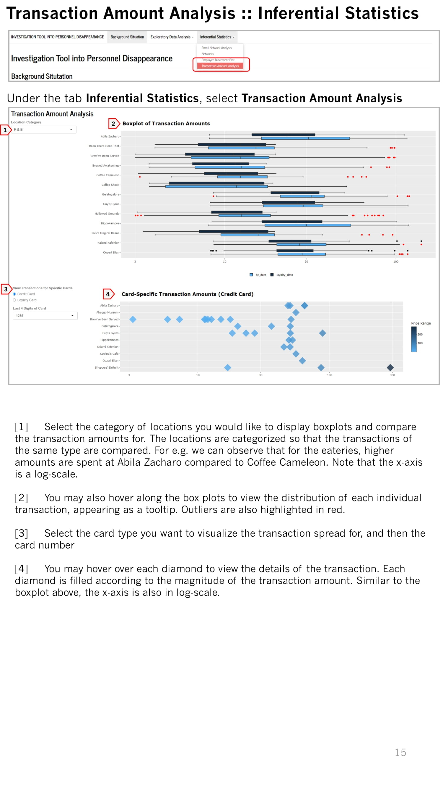
```


