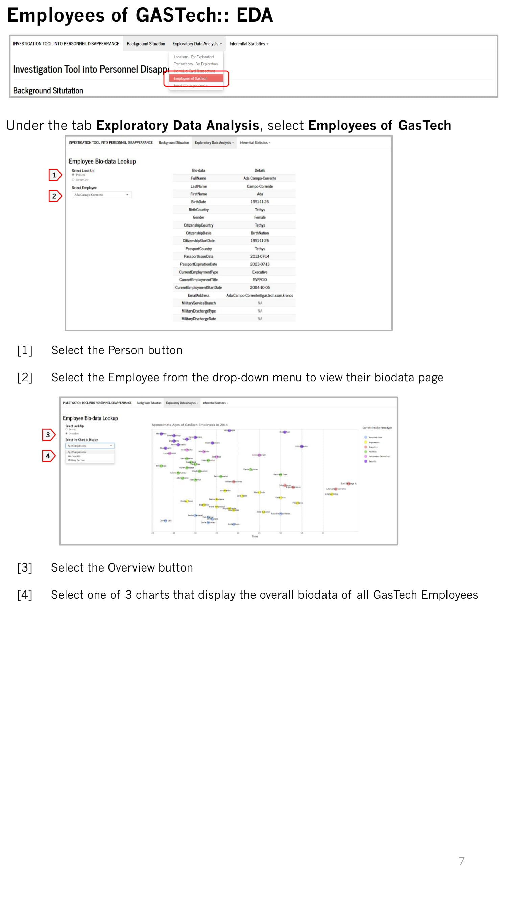
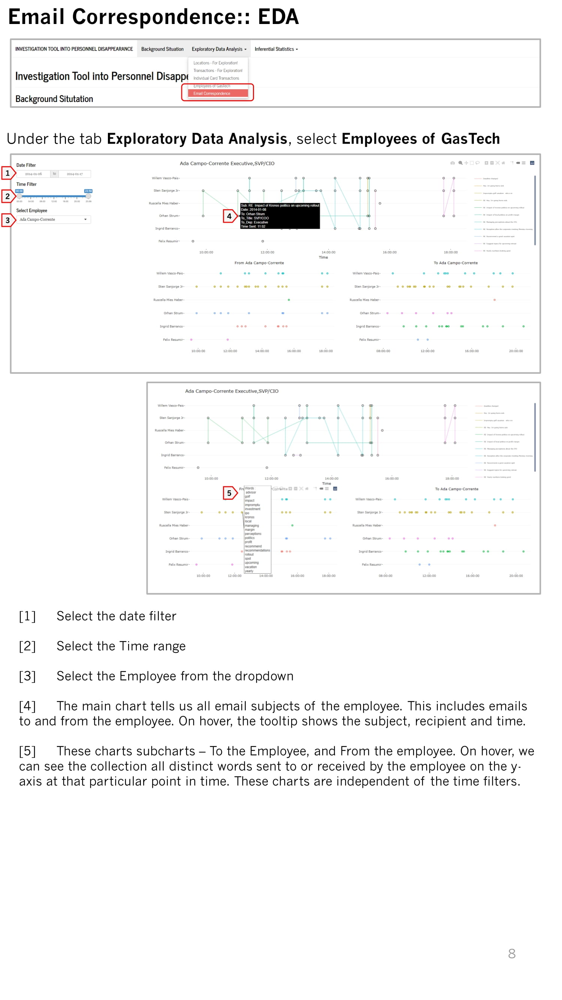
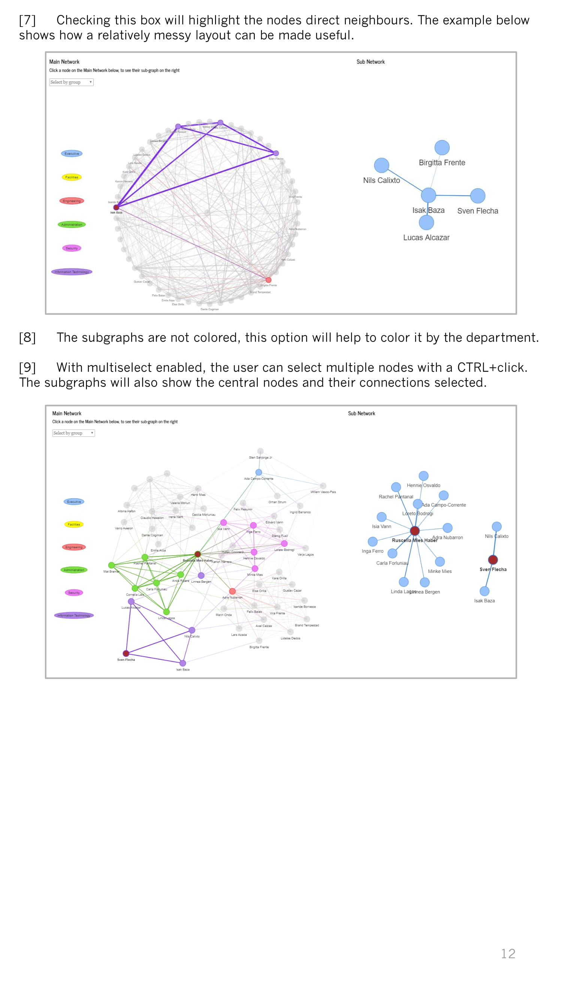

<style>
.hscroll-plot {
    width: 1000px;
    height: 900px;
    overflow-y: scroll;
    overflow-x: hidden;
}
</style>

<div class="hscroll-plot">


```{r setup, include=FALSE}
knitr::opts_chunk$set(echo = FALSE)
```

**Click on the pages to see an enlarged version**

```{r, fig.}
knitr::include_graphics("UserGuide_IMAGES/R Shiny User Guide-01.jpg")
```

```{r}
knitr::include_graphics("UserGuide_IMAGES/R Shiny User Guide-02.jpg")
```

```{r}
knitr::include_graphics("UserGuide_IMAGES/R Shiny User Guide-03.jpg")
```

```{r}
knitr::include_graphics("UserGuide_IMAGES/R Shiny User Guide-04.jpg")
```

```{r}
knitr::include_graphics("UserGuide_IMAGES/R Shiny User Guide-05.jpg")
```

```{r}
knitr::include_graphics("UserGuide_IMAGES/R Shiny User Guide-06.jpg")
```

```{r}

```

```{r}

```

```{r}
knitr::include_graphics("UserGuide_IMAGES/R Shiny User Guide-09.jpg")
```

```{r}
knitr::include_graphics("UserGuide_IMAGES/R Shiny User Guide-10.jpg")
```

```{r}
knitr::include_graphics("UserGuide_IMAGES/R Shiny User Guide-11.jpg")
```

```{r}

```

```{r}
knitr::include_graphics("UserGuide_IMAGES/R Shiny User Guide-13.jpg")
```

```{r}
knitr::include_graphics("UserGuide_IMAGES/R Shiny User Guide-14.jpg")
```

```{r}
knitr::include_graphics("UserGuide_IMAGES/R Shiny User Guide-15.jpg")
```


</div>