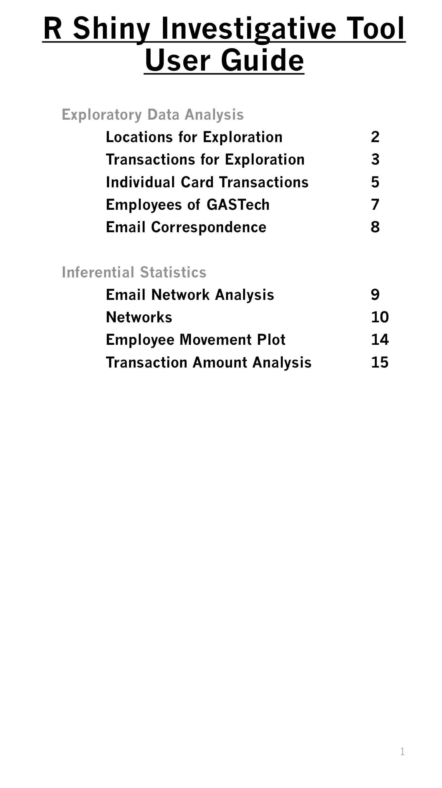
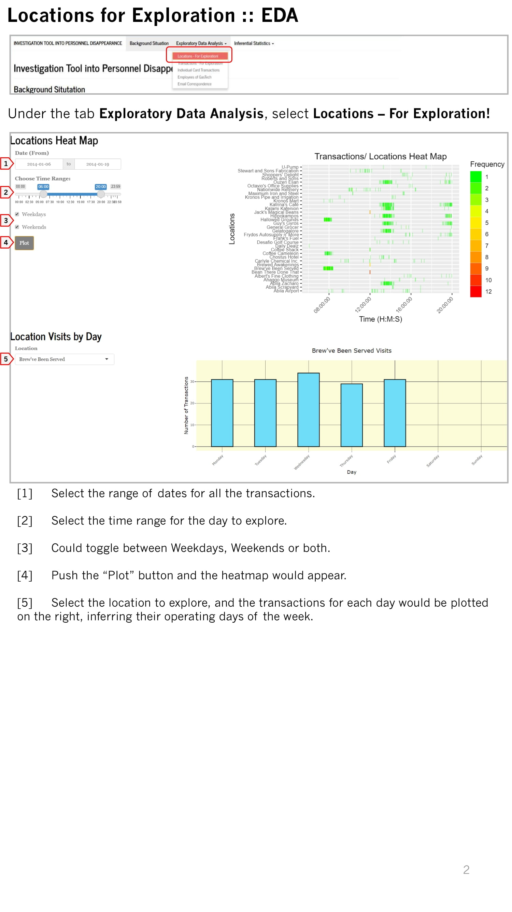
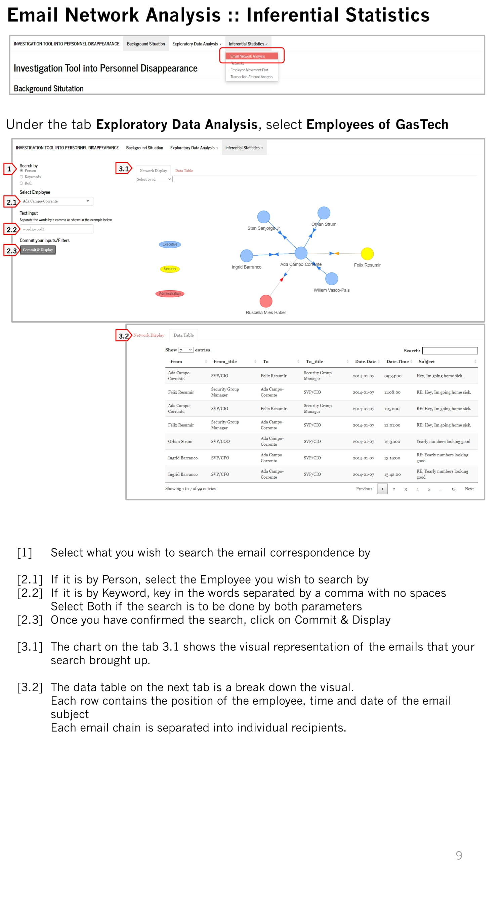
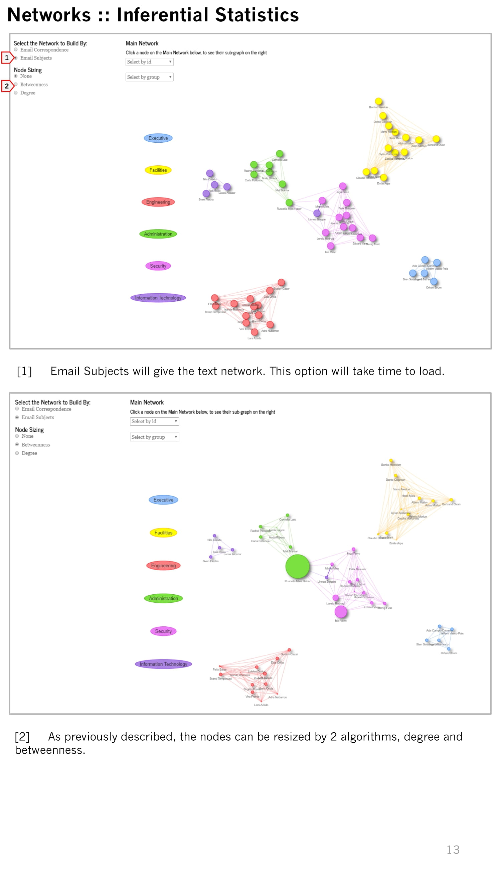

```{css zoom-lib-src, echo = FALSE}
script src = "https://ajax.googleapis.com/ajax/libs/jquery/3.4.1/jquery.min.js"
```


```{js zoom-jquery, echo = FALSE}
 $(document).ready(function() {
    $('body').prepend('<div class=\"zoomDiv\"></div>');
    // onClick function for all plots (img's)
    $('img:not(.zoomImg)').click(function() {
      $('.zoomImg').attr('src', $(this).attr('src')).css({width: '100%'});
      $('.zoomDiv').css({opacity: '1', width: 'auto', border: '1px solid white', borderRadius: '5px', position: 'fixed', top: '50%', left: '50%', marginRight: '-50%', transform: 'translate(-50%, -50%)', boxShadow: '0px 0px 50px #888888', zIndex: '50', overflow: 'auto', maxHeight: '100%'});
    });
    // onClick function for zoomImg
    $('img.zoomImg').click(function() {
      $('.zoomDiv').css({opacity: '0', width: '0%'}); 
    });
  });
```

```{r setup, include=FALSE}
knitr::opts_chunk$set(echo = FALSE)
```

**Click the link below to download**

```{r echo=FALSE}
xfun::embed_file('User Guide/R Shiny User Guide.pdf')
```

**Click on the pages to see an enlarged version**

```{r, fig.}

```

```{r}

```

```{r}
knitr::include_graphics("UserGuide_IMAGES/R Shiny User Guide-03.jpg")
```

```{r}
knitr::include_graphics("UserGuide_IMAGES/R Shiny User Guide-04.jpg")
```

```{r}
knitr::include_graphics("UserGuide_IMAGES/R Shiny User Guide-05.jpg")
```

```{r}
knitr::include_graphics("UserGuide_IMAGES/R Shiny User Guide-06.jpg")
```

```{r}
knitr::include_graphics("UserGuide_IMAGES/R Shiny User Guide-07.jpg")
```

```{r}
knitr::include_graphics("UserGuide_IMAGES/R Shiny User Guide-08.jpg")
```

```{r}

```

```{r}
knitr::include_graphics("UserGuide_IMAGES/R Shiny User Guide-10.jpg")
```

```{r}
knitr::include_graphics("UserGuide_IMAGES/R Shiny User Guide-11.jpg")
```

```{r}
knitr::include_graphics("UserGuide_IMAGES/R Shiny User Guide-12.jpg")
```

```{r}

```

```{r}
knitr::include_graphics("UserGuide_IMAGES/R Shiny User Guide-14.jpg")
```

```{r}
knitr::include_graphics("UserGuide_IMAGES/R Shiny User Guide-15.jpg")
```

